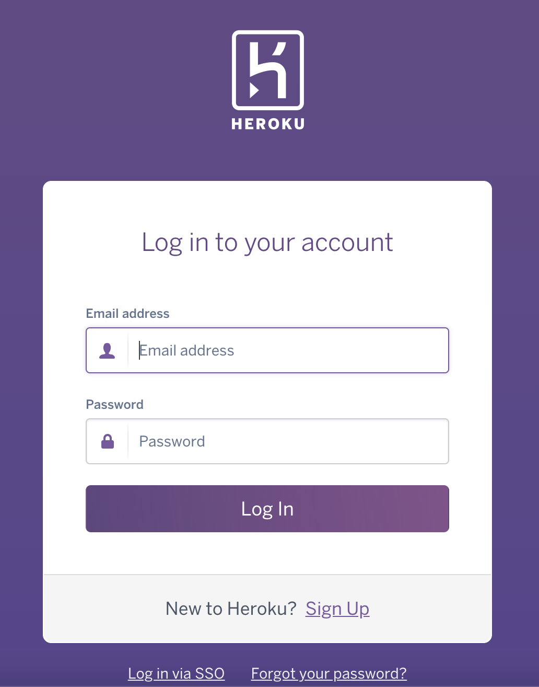
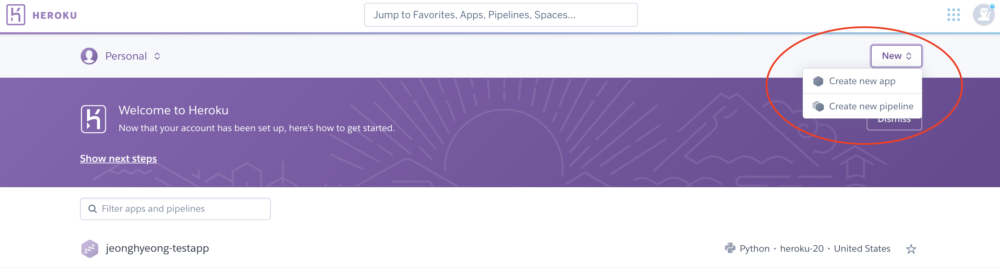
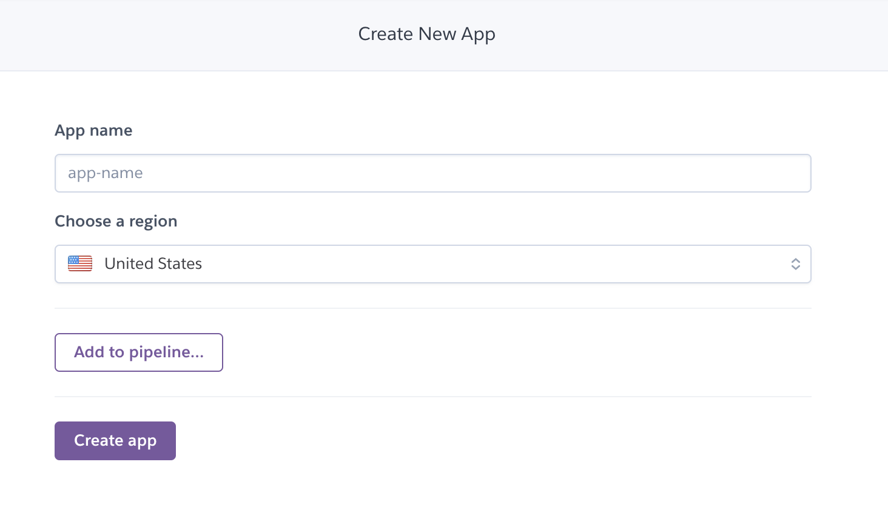
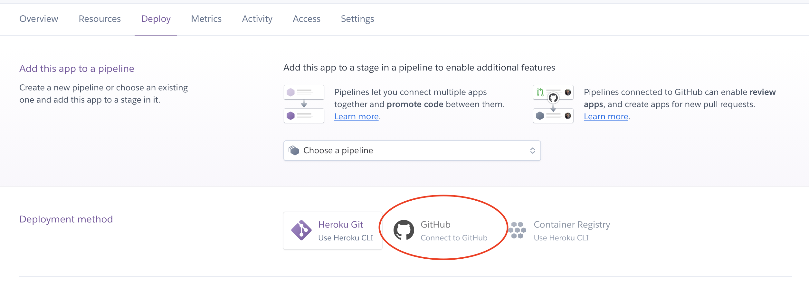
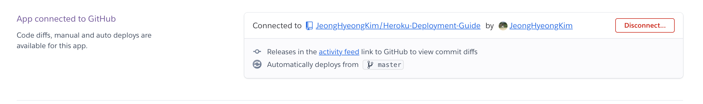
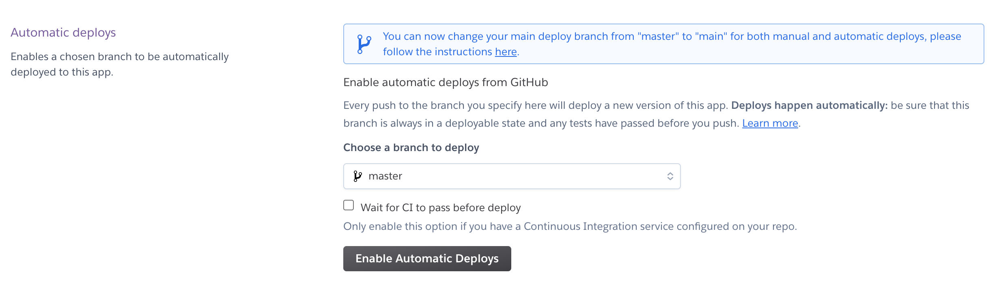
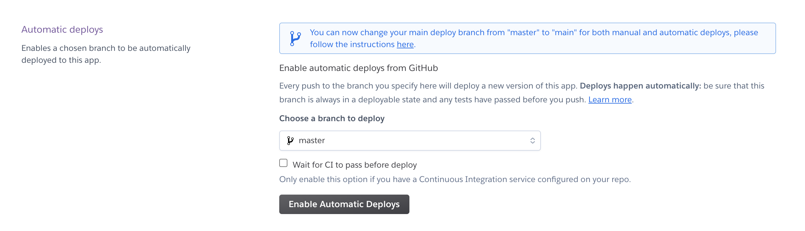
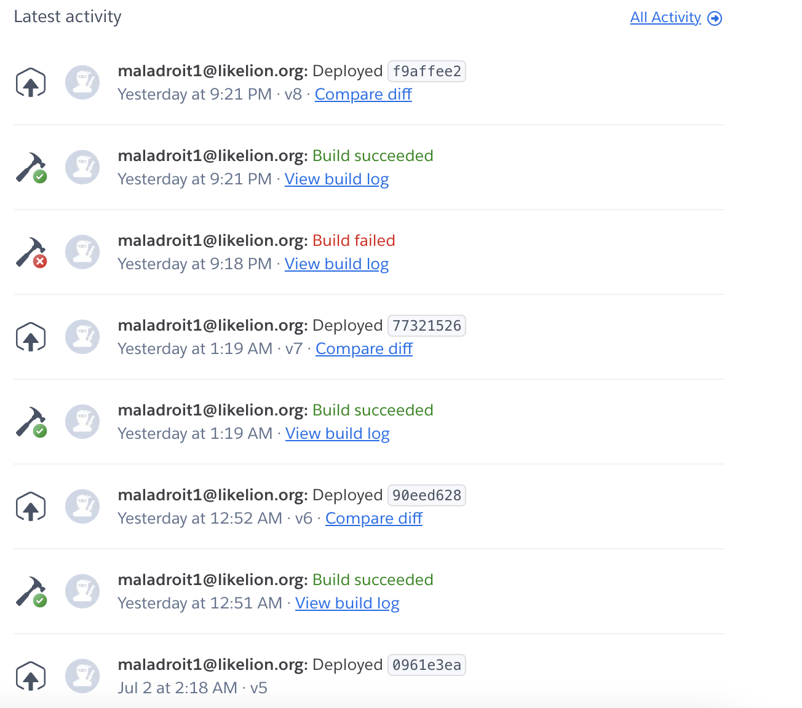
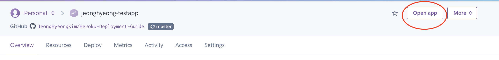
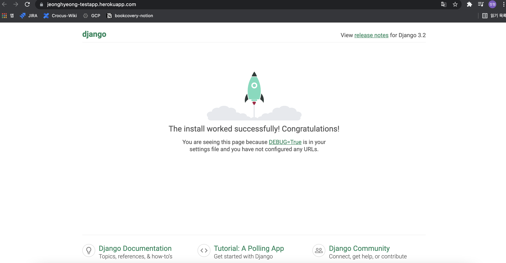

# Django-Heroku-Deployment-Guide

## 0. Heroku 간략 설명

Heroku는 여러 언어(Python, nodejs, Java)등을 지원하는 PaaS 클라우드 서비스이다. 방문자 수가 적은 서비스에 대해서는 현재 무료로 제공하고 있다.
Heroku에서 지원하는 기능을 간략하게 정리하면 다음과 같다.

1. Code Integration & Code Deployment
2. DB Add on
3. Git Integration
4. App Metric 모니터링 (유료)
5. Pipeline 설정
6. Deploy History 관리
7. Heroku 도매인 제공

## 1. Heroku 가입

https://www.heroku.com 접속하면 다음과 같은 화면을 볼 수 있다.

<br/><br/>

Signup 버튼 클릭 후, 아래 폼을 작성하여 회원가입을 완료한다.
중간쯤에 Korea, Republic of가 있으니 Country는 그것을 선택하도록 한다.


## 2. Heroku 세부 설정

### 1. runtime.txt

runtime.txt는 deploy환경에서 사용할 python version을 명시해주면 됩니다.
현재 멋쟁이사자처럼 9기 여러분들은 3.9.2버전을 사용하기 때문에 아래 {YOUR_PYTHON_VERSION}애 3.9.2를 입력합니다.

```
python-{YOUR_PYTHON_VERSION}
```

### 2. Procfile

Procfile은 deploy후, 실행시킬 app을 찾습니다. 다음과 같이 startproject를 하였을 때, 만들어진 wsgi를 이용하도록 합니다.
web: gunicorn {YOUR_PROJECT_NAME}.wsgi

### 3. requirements.txt

여러분이 만든 Django App에서 사용할 의존성을 관리하는 파일입니다. 장고를 구성하는 프로젝트 폴더에서 다음 명령어를 이용하여 가상환경을 생성합니다.

```
python -m venv .venv
```

그런다음, 가상환경을 실행합니다.

```
linux : source .venv/bin/activate
window : source .venv/Scripts/activate
```

필요한 패키지를 설치하고, 다음 명령어를 이용하여 의존성을 뽑아내봅시다.

```
python -m pip freeze > requirements.txt
```

requirements.txt에 heroku deploy를 위해 필요한 패키지를 추가합니다.

```
django-heroku==0.3.1
gunicorn==20.1.0
psycopg2==2.9.1
whitenoise==5.2.0
dj-database-url==0.5.0
```

#### 4. settings.py 수정

다음과 같은 코드를 추가한다.

```
import django_heroku
django_heroku.settings(locals())
```

## 3. Heroku 설정

### 1. App Create

만든 계정으로 로그인 후, new -> create app을 클릭한다.


다음과 같이 app name을 입력하고 app을 생성한다.


### 2. App Configuration

app 생성 후, deploy탭의 Deployment method에서 github를 선택한다.


git로그인을 한 다음, 다음과 같이 deploy하고자 하는 repository를 선택해준다.


선택한 다음, main(master) branch에 commit할 시, 자동으로 배포되도록 한다.


자동배포가 마음에 안든다면, 아래 화면에서 수동 deploy를 할 수 있다.


### 3. Git Commit

지금까지 작업한 내용을 main(master)에 커밋한다.

```
git add .
git commit -m "<YOUR_COMMIT_MESSAGE>"
git push origin main(master)
```

### 4. Build Log 확인 및 App 확인

auto deploy가 시작되었거나, manual deploy를 이용하면 다음과 같이 빌드이력 및 로그를 볼 수 있다.


Build Log를 조회하였을 때, 다음과 같이 release되어야 정상이다.

```
-----> Building on the Heroku-20 stack
-----> Using buildpack: heroku/python
-----> Python app detected
-----> Using Python version specified in runtime.txt
 !     Python has released a security update! Please consider upgrading to python-3.9.6
       Learn More: https://devcenter.heroku.com/articles/python-runtimes
-----> No change in requirements detected, installing from cache
-----> Using cached install of python-3.9.2
-----> Installing pip 20.2.4, setuptools 47.1.1 and wheel 0.36.2
-----> Installing SQLite3
-----> Installing requirements with pip
-----> $ python manage.py collectstatic --noinput
       128 static files copied to '/tmp/build_d339b843/staticfiles', 406 post-processed.
-----> Discovering process types
       Procfile declares types -> web
-----> Compressing...
       Done: 61.1M
-----> Launching...
       Released v8
       https://jeonghyeong-testapp.herokuapp.com/ deployed to Heroku
```

그런다음, 다음 화면의 open app을 클릭하여 정상적으로 django 시작화면이 나오는지 확인한다.


