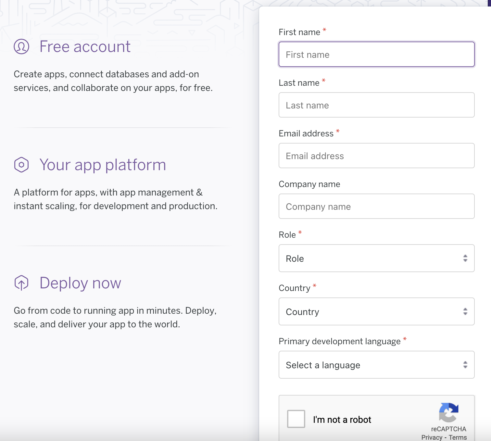

# Django-Heroku-Deployment-Guide

## 0. Heroku 간략 설명

Heroku는 여러 언어(Python, nodejs, Java)등을 지원하는 PaaS 클라우드 서비스이다. 방문자 수가 적은 서비스에 대해서는 현재 무료로 제공하고 있다.
Heroku에서 지원하는 기능을 간략하게 정리하면 다음과 같다.

1. Code Integration & Code Deployment
2. DB Add on
3. Git Integration
4. App Metric 모니터링 (유료)
5. Pipeline 설정
6. Deploy History 관리
7. Heroku 도매인 제공

## 1. Heroku 가입

https://www.heroku.com 접속하면 다음과 같은 화면을 볼 수 있다.

  

Signup 버튼 클릭 후, 아래 폼을 작성하여 회원가입을 완료한다.
중간쯤에 Korea, Republic of가 있으니 Country는 그것을 선택하도록 한다.

## 2. Heroku 세부 설정

## 3. Heroku
